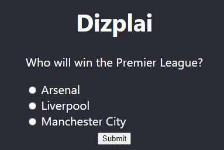

# Spring boot Java Application - Vote REST API
The solution consist of wo parts - a REST API and a web client application. The API can be used with a *postman* or *swagger* API. This project provides REST endpoints through which a poll can be initialised, a vote cast, the votes saved and the outcome of the poll viewed. An accompanying client, a web client, is provided separately in voting-app project.
### Tech stack
1. API tech stack consists of Spring boot, Java, Maven, Junit5, Swagger. Verify Java 21 is installed. From terminal or command prompt, run java --version
2. The client is a React app. Verify node version is v20.17.0 or higher and npm version is 10.8.2 or higher
### Instructions
To run the service:
1. Make a directory ```D:/data/votedb```. This is the destination location for h2 database. If you use a different location e.g. linux system, change the value of the property ```spring.datasource.url``` in the file ```src/main/resources/application.properties```
2. Checkout the voting-api git project
3. Change to the project root directory
4. Run ```mvn spring-boot:run``` or, ```mvn package```, followed by ```java -jar target/voting-api-0.0.1-SNAPSHOT.jar```
5. Using postman OR from the application's swagger endpoint at ```http://localhost:8080/swagger-ui/index.html``` enter a poll input shown below and execute
6. To run tests, ```mvn clean test```

```
{
    "question": "Who will win the Premier League?",
    "options": [
    "Manchester City",
    "Arsenal",
    "Liverpool"
    ]
}
```

### Running the postman client
Once the poll is initialised via the step 4. above, you can use postman to 
1. Submit a vote at ```http://localhost:8080/api/v1/poll/1/vote``` with payload ```{"voteCast": "Arsenal"}```. 
2. You can view the distribution of votes at ```http://localhost:8080/api/v1/poll/{pollId}/votes```. Replace the ```pollId``` with the value returned from the step 4 above. 
3. To view the details of ballots, use ```http://localhost:8080/api/v1/poll/{pollID}/ballots```. Replace the ```pollId``` with the value returned from the step 4 above.
4. To view the poll details created in step 4 above, use ```http://localhost:8080/api/v1/poll/{pollId}```. Replace the ```pollId``` with the value returned from the step 4 above.
5. To view the options for the poll in step 4 above, use ```http://localhost:8080/api/v1/poll/{pollId}/options```. Replace the ```pollId``` with the value returned from the step 4 above.

### Running the web client
To run the web client,
1. Checkout the voting-app git project
2. Change to the project root directory
3. Run ```npm start```

You should find

